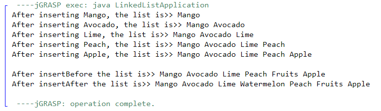
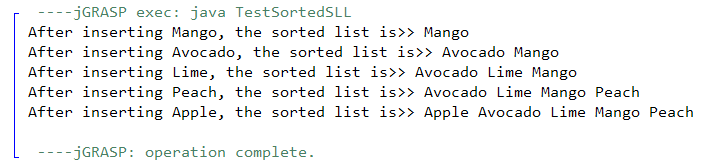

**King Fahd University of Petroleum & Minerals**

**College of Computer Science and Engineering**

**Information and Computer Science Department**

**ICS 202 – Data Structures**

# Linked Lists-Part I

**Objectives**

The objective of this lab is to design, implement and use Linked Lists

**Outcomes**

After completing this Lab, students are expected to:

-   Understand the structure of a singly linked list class
-   Add methods and enhance the functionality of a linked list class
-   Use linked lists class in an application

**Notes**

For the purpose of this lab, you may download the attached programs.

**Lab Exercises**

1\. Download the files related to Linked Lists associated with this lab. Compile and run the programs.

2\. Warm-up Exercise: Write a method **public int length()** in the class SLL\<T\>.java that returns the length of the linked list. (Additional Exercise: Can you make a recursive length method?)

3\. Add the following methods to the class **SLL\<T\>.java**:

(a) **public void insertBefore(T newElem, T existingElem)** that inserts an element **newElem** before the element **existingElem**. If no **existingElem** exists, then the method prints **existingElem does not exist** and returns. If more than one instance of **exisingElem** exists, then the methods inserts before the first instance of **existingElem**.

For example, suppose your linked list (of integers) is: [ 3 5 4 2 9 ],

Then a call to **insertBefore(new Integer(5), new Integer(9))** would result in the following linked list: [ 3 5 4 2 5 9 ]

A call to **insertBefore(new Integer(7), new Integer(5))** would result in [ 3 7 5 4 2 5 9 ]

A call to **insertBefore(new Integer(8), new Integer(10))** would result in

WARNING: Element 10 does not exist in the linked list. Insertion failed.

(b) Add the following methods with the same methodology as **insertBefore:**

(i) **public void insertAfter(T newElem, T existingElem)**

(ii) **public void deleteBefore(T existingElem)**

(iii) **public void deleteAfter(T existingElem)**

Make sure you test for cases where the list has only one element.

(c) Write a **test class** to test these methods. The test data is as follows:

Make a new linked list, called **fruitList** of strings with the following information:

[“Mango”, “Avocado”, “Lime”, “Peach”, “Apple”]

Now

(a) insert before “Apple” the word “Fruits”.

(b) insert after “Lime” the word “Watermelon”

and print the list.

A Sample output is shown below:

Likewise, do the same for all four methods. Note that deleteBefore and deleteAfter take only one parameter.

4\. [Advanced: Optional] Write a class **SortedSLL\<T extends Comparable\<T\>\>** that creates a sorted list. A sorted list has a **public void** **insert(T newElem)** method that inserts each element of type **T** in its correct position (ascending order). Make sure you provide a delete method also that deletes a given element. Assume the list contains unique elements. You may need to modify the class SLL\<T\> to SLLNode\<T extends Comparable\<T\>\>.

A Sample Output is shown below:

