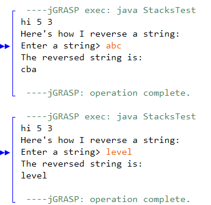
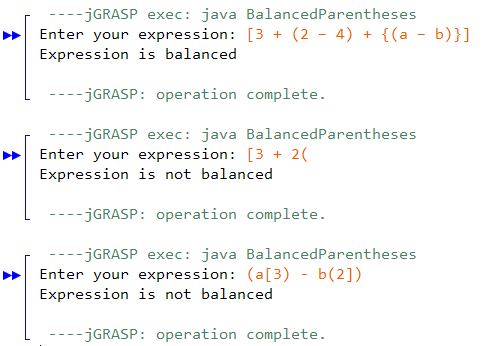
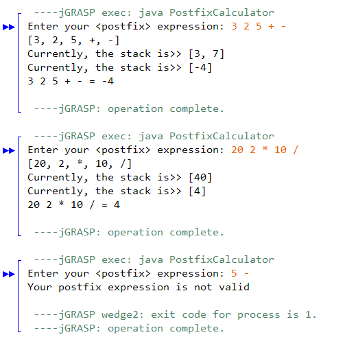
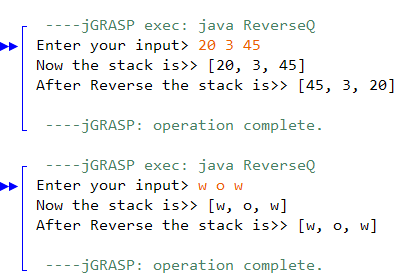

**King Fahd University of Petroleum & Minerals**

**College of Computer Science and Engineering**

**Information and Computer Science Department**

**ICS 202 – Data Structures**

# Stacks and Queues

**Objectives**

The objective of this lab is to design, implement and use Stacks and Queues.

**Outcomes**

After completing this Lab, students are expected to:

• Design classes for Stacks and Queues.

• Implement Stack and Queue classes using array and Linked Lists.

• Developing applications that use stacks and Queues.

**Notes**

For the purpose of this lab, you may download the attached programs.

**Lab Exercises**

1\. Study the associated files **LabStack.java,** and **LabQueue.java**. Also study the class **StacksTest.java**. Download and run these programs. [Note: To avoid confusion with builtin classes Stack and Queue, we use the names LabStack and LabQueue for our classes] A sample session is shown below:

2\. Write a program **BalancedParentheses.java**. The algorithm for evaluating parentheses is as follows:

(a) Remove all non-parentheses from a mathematical expression.

(b) Given an opening parenthesis, i.e., a ‘[‘, a ‘(‘ or a ‘{‘, push it onto the stack.

(c) Given a closing parenthesis, pop an opening parenthesis from the stack:

(i) if the closing and opening parenthesis match, it is a successful match

(ii) if the parentheses do not match, the expression is not balanced

(iii) if the stack is empty, the expression is not balanced

(d) if, at the end of the program, the stack is empty, then the expression is balanced.

For example: **[3 + (2 – 4) + {(a – b)}]** is balanced, while **[3 + 2(** and **{ 7 + [ a – b} ]** are not balanced. A sample session is shown here:

3\. Write a program to evaluate postfix expressions using a **LabStack**. Use the same algorithm as presented in your slides. For example if the user input is: 3 2 + 4 \*, then the output should show the contents of the stack after every operation and also the final result. Make your program interactive so the user can provide input. [Observe that there are spaces in the input to separate the integers. Optional: Check is the postfix expression is valid or not as shown in the sample session below]

4\. Write a program to reverse the order of elements on stack **s** using a **LabQueue**. A sample session is shown below:

