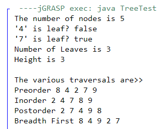

**King Fahd University of Petroleum & Minerals**

**College of Computer Science and Engineering**

**Information and Computer Science Department**

**ICS 202 – Data Structures**

# Lab 06: Binary Trees

**Objectives**

The objective of this lab is to design, implement and use binary trees.

**Outcomes**

After completing this Lab, students are expected to:

• Understand classes for binary trees.

• Implement methods for binary trees.

• Traverse binary trees (breadth-first, depth-first)

• Insert into and delete from binary trees.

**Notes**

For the purpose of this lab, you may download the attached programs. Note that the code refers to binary search trees.

**Lab Exercises**

1.  Write a method **public int count()** to count the number of nodes in a binary tree.
2.  Write a method **public boolean isLeaf(T value)** to determine if a node with a given value is a leaf. [Note: since the code corresponds to a BST, nodes with duplicate values are not possible]
1.  Write a method **public int countLeaves()** to count the number of leaves in a binary tree.
2.  Write a method **public int height()** to find the height of a binary tree.
1.  Write a program that creates a binary tree with random keys, traverses it using the breadth-first and depth-first (preorder, inorder, and postorder) and prints the results. It also tests the above methods. For example, for the following tree:

|   | Breadth-First traversal prints: 8 4 9 2 7 Preorder Depth First Traversal prints: 8 4 2 7 9  Inorder Depth First Traversal prints: 2 4 7 8 9 Post Order Depth First Traversal prints: 2 7 4 9 8   |
|--------------------------------------------------|--------------------------------------------------------------------------------------------------------------------------------------------------------------------------------------------------|

A sample output is shown below for all exercises:

