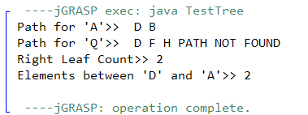

**King Fahd University of Petroleum & Minerals**

**College of Computer Science and Engineering**

**Information and Computer Science Department**

**ICS 202 – Data Structures**

# Binary Search Trees Practice

**Objectives**

The objective of this lab is to design, implement and use binary trees. This lab is a continuation of the previous lab work.

**Notes**

For the purpose of this lab, you may download the attached programs. Note that the code refers to binary search trees.

**Lab Exercises**

**Given a binary (search) tree, design and implement the following methods in the class BST\<T\>.** [Your methods should not invoke other methods, except helper methods if needed]

1\. **public String getPath(T t1)**

This method finds and returns the path from the root to a given node (value) t1. This should be recursive. Your output could be as follows (for the tree shown in the (b))

2\. **public int getRightLeafCount()**

This method finds and returns the number of leaves that are right children. This should be recursive. For example if your given binary tree is:

|  D  / \\  B F  / \\ \\ A C H  | getPath(new String(“C”))   This will return “D B C” which is the path from the root to a given node t1, in this case “C”.  getRightLeafCount() returns 2 |
|-------------------------------|----------------------------------------------------------------------------------------------------------------------------------------------------------|

3\. Write a recursive instance method: **public static int rangeCounter(T t1, T t2)** in the BST class that counts the number of elements that are greater than t1 and less than t2 in the BST. Assume that the invoking BST object has distinct keys, and t1 \< t2 (t1.compareTo(t2) \< 0).

4\. Use the given test class to test for these methods. A sample output session is shown below:

