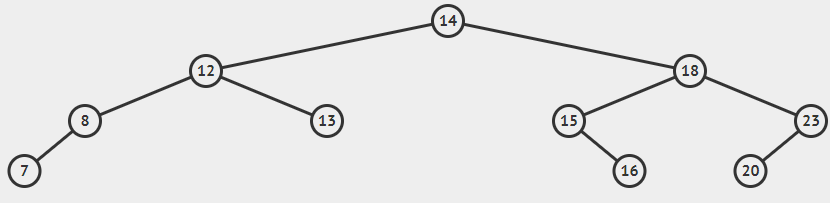

**King Fahd University of Petroleum & Minerals**

**College of Computer Science and Engineering**

**Information and Computer Science Department**

**ICS 202 – Data Structures**

# AVL Trees

**Objectives**

The objective of this lab is to design, implement and use AVL trees.

**Outcomes**

After completing this Lab, students are expected to:

• Design classes for AVL trees.

• Delete from AVL trees.

**Notes**

For the purpose of this lab, you may download the attached programs.

**Lab Exercises**

1.  Complete the class **AVLTree** that extends **BST**. It should have four methods RotateLeft, RotateRight, RotateLeftRight, and RotateRightLeft. You have to provide the methods **rotateRight**(), and **rotateRightLeft**. Provide the method **deleteAVL(T el)** to delete elements in the AVL tree. Note that the BST class for AVL trees has been modified to have an extra constructor.
2.  Create an AVL tree in which the following keys are inserted in the given order:

    8, 14, 12, 18, 23, 20, 15, 13, 7, 16

    Print the resulting AVL tree in BFS. Your BFS result should correspond to the following AVL Tree:

    

    Now ask the user to provide any 3 elements to delete. After deleting the elements, print the BFS of the AVL tree again.

3.  Create an AVL tree of strings. Test your program on the given text file (sampletextfile.txt). After creating the AVLTree of strings, print the AVLTree using inorder traversal. [Note: Do not insert duplicate words in your AVL tree]
