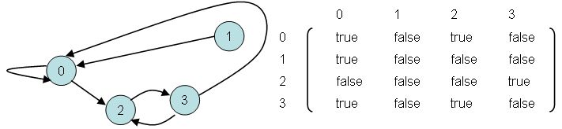
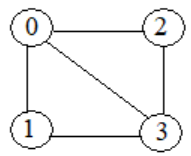
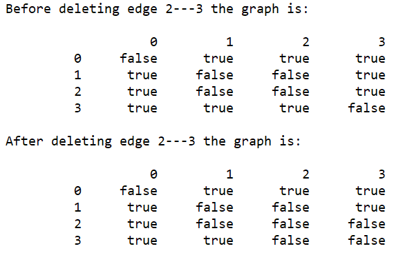
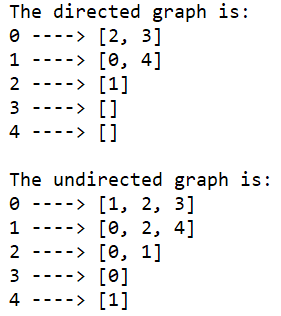
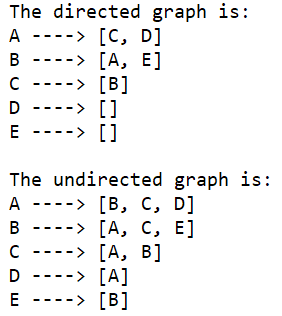
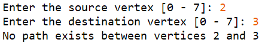
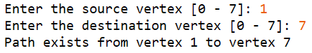
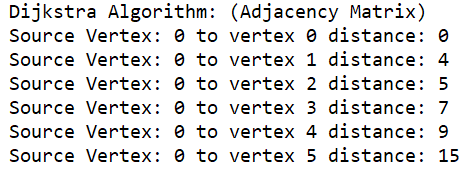

**King Fahd University of Petroleum & Minerals**

**College of Computer Science and Engineering**

**Information and Computer Science Department**

**ICS 202 – Data Structures**

# Graphs

**Objectives:**

-   Study the AdjacencyMatrix and AdjacencyList representation of graphs.
-   Study the implementation of Graph traversals.
-   Study the implementation of Dijkstra’s single source shortest path algorithm.

**Outcomes:**

After completing this lab, students will know:

-   How to represent graphs using AdjacencyMatrix and AdjacencyList representations.
-   How to traverse graphs using DFS and BFS traversals.
-   How to use the BFS traversal to solve the reachability problem.
-   How to implement Dijkstra’s single source shortest path algorithm and how to use the algorithm to solve a given shortest path problem.

**Submissions**: Submit, in your lab section Blackboard, the Java files for each of the lab task is a separate folder, named as: Task01, Task02, Task03, and Task04. Zip all the folders in a **single zip** file named in the format:

LabSection\#_KFUPMID.zip

Example:

52_200000000.zip

**Note:**

-   For Task04 [optional] , you are also required to submit a word document containing the table of the manual tracing of Dijkstra’s single source shortest path algorithm, together with the diagram of the Shortest Path Graph (SPG).
-   Follow the submission deadline given by your lab instructor.

**Lab Activity 01**: Graph representations

Study the different graph representations in the folder **LabActivity01_GraphRepresentations**.

**Lab Activity 02**: Graph Traversals

Study the different graph traversal implementations in the folder **LabActivity02_GraphTraversals**.

**Lab Task01**: Consider the adjacency matrix representation given below:

In the following lab task you are required to modify the **Graph.java** in the folder **LabTask01** such that it represents a graph using adjacency matrix representation similar to the above representation.

1.  Complete the method: **public void addEdge(int i, int j)** to add an undirected edge **i --- j** to the graph.

    Note: For an undirected graph, if an edge i **--- j** is added to the graph then the reverse edge **j --- i** must also be added.

2.  Complete the method: **public void removeEdge(int i, int j)** to remove an undirected edge **i --- j** from the graph

    Note: For an undirected graph, an edge **i --- j** is removed from the graph then the reverse edge **j --- i** must also be removed.

3.  Complete the method: **public boolean isEdge(int i, int j).** The method returns **true** if **i --- j** is an undirected edge in the graph; otherwise, it returns **false**.
4.  Complete the driver class by creating the following graph:

Run the program to get an output of the following form:

**Lab Task02:** Consider the graph represented in the folder: **Task02\\GraphAsAdjacencyList**. The output of the program is:

Modify the program such that the vertices 0, 1, 2, 3, and 4 are mapped to vertices A, B, C, D, and E and the output of the program becomes:

**Hint**: In the driver class, declare an array **labels** of Strings:

| 0    | 1    | 2   | 3   | 4   |
|------|------|-----|-----|-----|
| "A " | "B " | "C" | "D" | "E" |

Pass this array to the **Graph** constructor:

Graph g = new Graph(5, labels);

Modify the instance variables and Constructor of **Graph.java** as follows:

int numVertices;

LinkedList\<String\>[] adjacencyList;

String[] labels;

Graph(int numVertices, String[] labels) {

this.labels = labels;

this.numVertices = numVertices;

adjacencyList = new LinkedList[numVertices];

for (int i = 0; i \< adjacencyList.length; i++)

adjacencyList[i] = new LinkedList\<String\>();

}

Then modify the following methods of **Graph.java** accordingly:

//To add a directed edge to graph

void addDirectedEdge(int v, int w) {

// To be completed by students

}

//To add undirected edge to graph

void addUndirectedEdge(int v, int w) {

// to be completed by students

}

void displayGraph(){

// to be completed by students

}

**Lab Task 03:**

Complete the **Graph.java** method: **private boolean isReachable(int src, int dest, boolean[] visited)** in the folder **Task03** such that it returns **true** if the destination vertex **dest** is reachable from the source vertex **src**; otherwise, it returns **false**.

Complete the test program to prompt for and read the source and destination vertices. It then checks whether the destination vertex is reachable from the source vertex. [Note: Assume that the values read are valid.]

Sample program runs:

|   |
|--------------------------------------------------|
|   |

**Lab Task 04 [Optional]**: Dijkstra’s single source shortest path algorithm

Manually trace Dijkstra’s single source shortest path algorithm on the graph below, using the given table. Verify your answer by creating the graph in the main method of **DijkstraAdjacencyMatrix.java** and then invoking the **dijkstra_GetMinDistances(int sourceVertex)** method of **DijkstraAdjacencyMatrix.java**

| Pass:          | initial | **1** | **2** | **3** | **4** | **5** | **6** | shortest distance | predecessor |
|----------------|---------|-------|-------|-------|-------|-------|-------|-------------------|-------------|
| Active vertex: |         |       |       |       |       |       |       |                   |             |
| **0**          |         |       |       |       |       |       |       |                   |             |
| **1**          |         |       |       |       |       |       |       |                   |             |
| **2**          |         |       |       |       |       |       |       |                   |             |
| **3**          |         |       |       |       |       |       |       |                   |             |
| **4**          |         |       |       |       |       |       |       |                   |             |
| **5**          |         |       |       |       |       |       |       |                   |             |

Draw the Shortest Path Graph (SPG):

Note: The output of your program must be:

