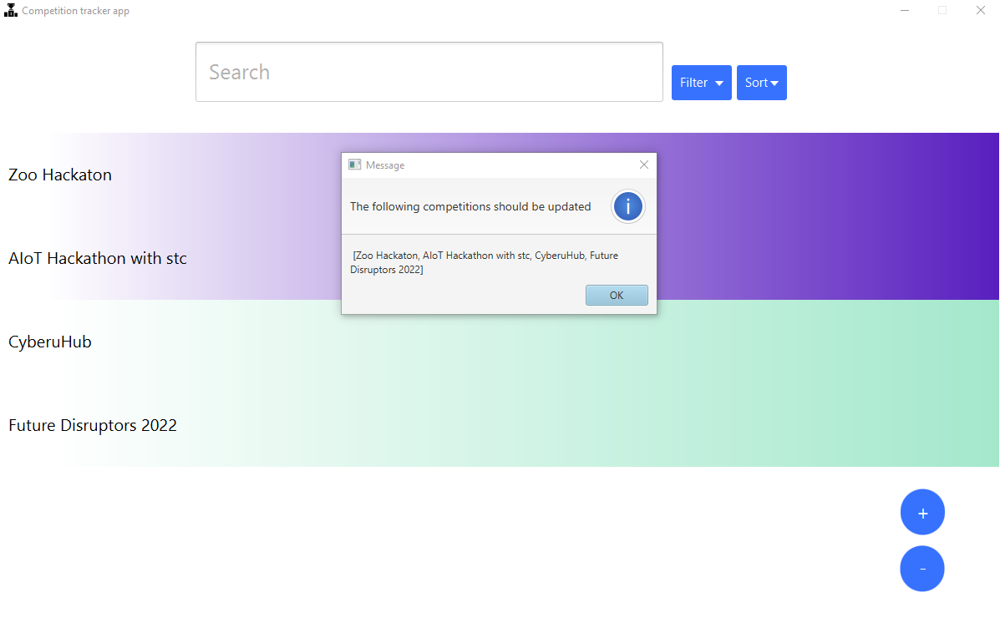

# About The Project

Hi!
This is the final project of SWE206 (**Introduction to Software Engineering**), which I took in term 211 (2021). The subject material was focused on introducing software processes, requirements analysis, and design models. The project is to make an application to track the university students participating in competitions. The project was in a team setting, composed of 3 phases. The first and second phases involved making a simple SRS document and designing diagrams like a use case diagram, class diagram, activity diagrams, and sequence diagrams. The third phase was to implement the application using Java. Although the project was simple, we had the opportunity to learn how to deal with the system's resources. For example, we had to read and write from an excel file since it was a database for the application. Also, the application could open links within the app, and it can also open the client's email app with a prepared message to send.

To get a complete understanding of the project, please read the project description in the _211-lab-project_ document and the report of phase 2.

_P.S_: The deadline was approaching, and we had to finish the implementation in less than 3 days, so we did not have time to refactor the code. That's why you might see little messy code, especially any JavaFX-related code.

# Overview

You can see a full walkthrough of the implementation [here](https://drive.google.com/file/d/1HRYL9sSuhV-xom7T51L0uAlNiExsAFX2/view?usp=sharing).

## Built With

- [Java](https://www.java.com/en/)
- [JavaFX](https://openjfx.io/)
- [Maven](https://maven.apache.org/)
- [Apache POI](https://poi.apache.org/)

## Getting Started

_soon_ I need to make sure of something first
